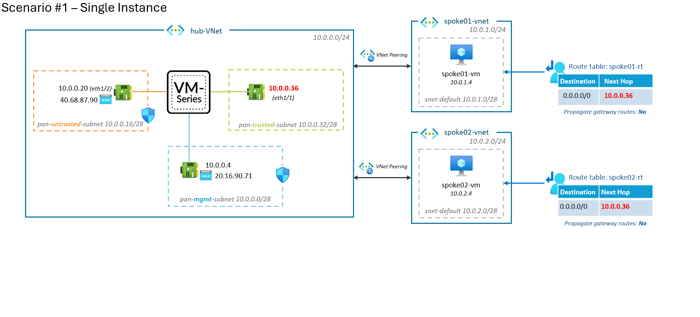

# MicroHack - Azure - Palo Alto Networks VM-Series Firewall

## Introduction

The **Palo Alto Networks VM-Series firewalls** offer robust control and protection for your applications housed within the Azure Cloud.

There are numerous ways to deploy PAN FW in Azure. This MicroHack is designed to explore the different scenarios that are possible.

## Scenarios

> The deployments in the following scenarios have been designed for **educational purposes**, not for production use.

* [Scenario #1: Single instance](scenario1/README.md)

Deploy a single instance of Palo Alto Firewall for a simple and straightforward protection solution.

* [Scenario #2: Active-Passive HA](scenario2/README.md)

Implement a High Availability Firewall with one active and one passive instance. The failover occurs within a few minutes.

* [Scenario #3: Active-Active loadbalanced with ELB/ILB](scenario3/README.md)

Opt for a High Availability Firewall with two active instances to distribute the load and minimize the risk of failure.

* [Scenario #4: Auto-Scaling loadbalanced with ELB/ILB](scenario4/README.md)

Utilize an auto-scaling Firewall setup that dynamically adjusts the number of active instances based on traffic load.

* [Scenario #5: Cloud NGFW for Azure](scenario5/README.md)

Deploy a Next-Generation Firewall for Azure directly in the cloud for advanced threat prevention and secure access control.

## Scenarios comparison

| Feature                  | Single Instance (#1)   | Active-Passive HA (#2) | Active-Active w. ELB/ILB (#3) | Auto-Scaling w. ELB/ILB (#4) | Cloud NGFW for Azure (#5) |  
|--------------------------|------------------------|-----------------------------|-----------------------------|----------------------|----------------------------|  
| Deployment Complexity    | Low                    | Moderate                    | Moderate                    | Moderate             | Low                        |  
| High Availability        | N/A                    | Yes *(with ~5min downtime)*       | Yes                         | Yes                  | Yes                        |  
| Scalability              | N/A                    | N/A                         | N/A                         | Yes                  | Yes                        |  
| Redundancy               | No                     | Yes                         | Yes                         | Yes                  | Yes                        |  
| Traffic Distribution     | N/A                    | N/A                         | Load balanced between instances | Load balanced between instances | Load balanced between instances |  
| Cost                     | +                      | ++                          | ++                          | +++                  | +++                        |  
| Security Features        | Standard               | Standard                    | Standard                    | Standard             | [Superior network security features](https://azure.microsoft.com/en-us/updates/public-preview-cloud-next-generation-firewall-for-azure-from-palo-alto-networks/) |  
| Management Complexity    | Simple                 | Moderate                    | Moderate                    | Moderate             | Simple *(managed service)* |  
| VPN termination          | Yes                    | Yes                         | No                          | No                   | No                         |  
| BGP peering              | Yes                    | Yes                         | Yes                         | No                   | No                         |  

## Appendix

* [Azure Gateway Load Balancer with PAN FW](https://github.com/vmisson/terraform-azure-gwlb-palo-alto)
* [VM-Series Models on Azure Virtual Machines (VMs)](https://docs.paloaltonetworks.com/vm-series/9-1/vm-series-performance-capacity/vm-series-performance-capacity/vm-series-on-azure-models-and-vms)

## Contributors ❤️❤️

* [Cynthia Treger](https://github.com/cynthiatreger)
* [Vincent Misson](https://github.com/vmisson)

 
