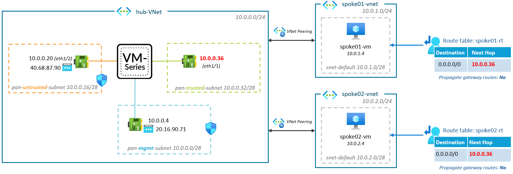
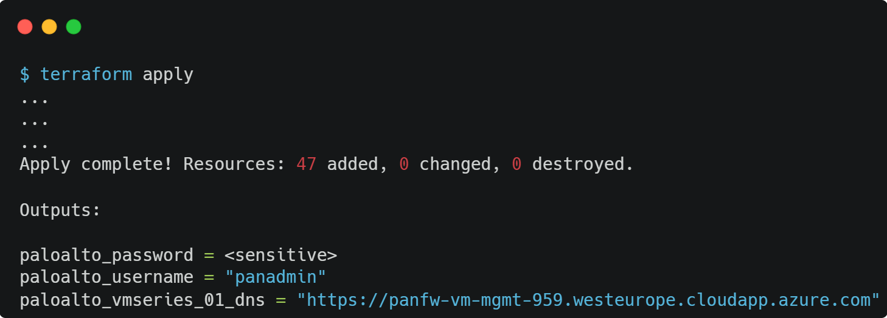
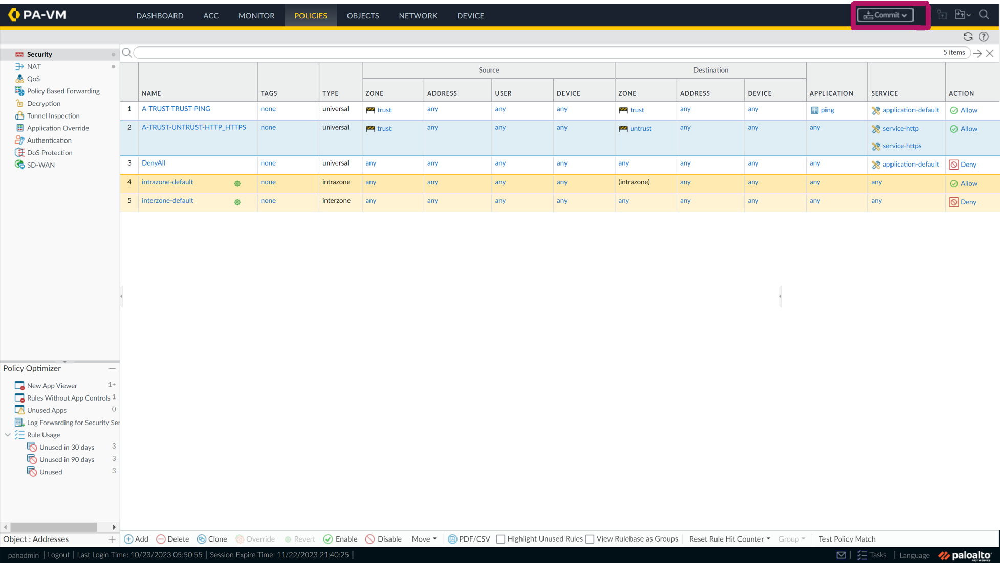
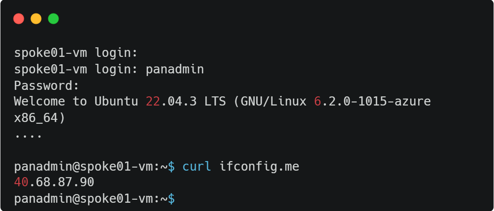
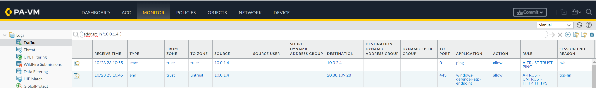

### [<< BACK TO THE MAIN MENU](../README.md)

# Scenario #1: Single instance

In this scenarion, we will be deploying a single instance of the VM-Series firewall on Azure.

## Overview

The proposed architecture consists of a single firewall instance set up within the Azure environment. This firewall acts as a control point for your network, overseeing and managing inbound and outbound network traffic based on preconfigured security rules.

Throughout the tasks in this scenario, we will guide you through:
* Deploying the template
* Enabling your public IP for console access, and 
* Connecting to the Palo Alto console. 

This will provide you with practical experience in setting up and managing a Palo Alto VM-Series firewall instance on Azure.

By the end of this scenario, you will have a fully operational Palo Alto firewall running in your Azure environment, ready to provide the necessary security measures for your applications.

## Task 1: Deploy Templates

To begin the Terraform deployment, following these steps:

- Sign in to Azure Cloud shell at [https://shell.azure.com/](https://shell.azure.com/) or use your local terminal

- Confirm that you are operating within the appropriate subscription by using:

`az account show`

- Accept the Azure Marketplace terms for the VM-Series images:

`az vm image terms accept --publisher paloaltonetworks --offer vmseries-flex --plan byol --subscription MySubscription` 

- Clone the current GitHub repository with the command: 

`git clone https://github.com/davidsntg/microhack-azure-panfw`

- Navigate to the new folder *microhack-azure-panfw/* and initialize the terraform modules with the commands:

`cd microhack-azure-panfw/scenario1/templates`

`terraform init`

- Start the deployment by running:

`terraform apply`

- When prompted, confirm the start of the deployment by responding with a **yes**.

- Wait for the deployment to finish, which should take approximately 10 minutes.

## Task 2: Enable your Public IP to Access the Palo Alto Console

The Palo Alto administration console can be accessed via HTTPS, using the appliance's public management IP.

During deployment, the public IP from which Terraform is executed provides access to the administration console. 

If this IP differs from the client's public IP accessing the administration console, the NSG `panfw-vm-mgmt-nsg` must be updated:

## Task 3: Connect to the Palo Alto Console

- Open a web browser and navigate to the console. The URL, username and password are given by the results of the previous `terraform apply`:

Run the command `terraform output paloalto_password` to display the password in plain text.

> **Note**: The Firewall may take between 5-10 minutes to start up. If the console does not appear, feel free to refresh the page.

## Task 4: Configure the Appliance to Allow VMs Internet Access

* Navigate to the *Policies* tab in the administration console. Under *Policies*, select *Security*. You will find a list of all security rules.

> You will see that the appliance has been created with two existing rules:
>  
> #1: `A-TRUST-TRUST-PING`: This rule allows for pinging between machines that are part of 'trust' zone.
>
> #2: `DenyAll`: This rule denies all that is not explicitly allowed.

* Create a new security rule by clicking on 'Add'. Configure the rule as follows:
  
  * Name: A-TRUST-UNTRUST-HTTP_HTTPS
  * Description: Allow machines coming from `trust` zone to go on to the Internet
  * Source zone: `trust`
  * Destination zone: `untrust`
  * Service: `service-http` and `service-https`
  * Action: Allow
  * Log at Session Start: `checked`
  * Log at Session End: `checked`

Click on 'OK' to save the rule

* To apply new created rule, commit your changes to update the firewall's configuration:

Now, the `spoke01-vm` and `spoke02-vm` VMs should have internet access through the VM-Series firewall. Let's test it!

## Task 4: Verify Internet Access for `spoke01-vm`

After updating the firewall's configuration, it is essential to verify that `spoke01-vm` has proper internet access.

Follow these steps to confirm:

* Within the `rg-panfw-scenario1` resource group, locate and select the `spoke01-vm`
* On the left sidebar, click on 'Serial Console'
* Login to the VM using same username and password that was previously used for the Palo Alto administration console
* Execute the following command: `$ curl ifconfig.me` 

As demonstrated, `spoke01-vm` has internet access and is using the public IP of the untrust NIC/Interface of the firewall.

## Task 5: Monitoring Traffic

* Navigate to the *Monitor* tab in the administration console:

As shown, you can monitor real-time network traffic on the appliance. This functionality is highly valuable, particularly for observing the traffic flow and identifying the rules triggered, which aids in troubleshooting.

## 🏁 Results

* We successfully deployed a single instance of the VM-Series firewall on Azure. The firewall acted as a control point, managing inbound and outbound network traffic.
* The public IP was enabled for console access and connection to the Palo Alto console was established. This provided hands-on experience in managing a VM-Series firewall.
* New security rules were created and applied to allow spokes VMs internet access. The effectiveness of these rules was verified, ensuring the VMs had proper internet access.
* We explored the real-time network traffic monitoring feature on the appliance. This feature is important for observing traffic flow, identifying triggered rules, and troubleshooting.

### [>> GO TO SCENARIO #2](../scenario2/README.md)
