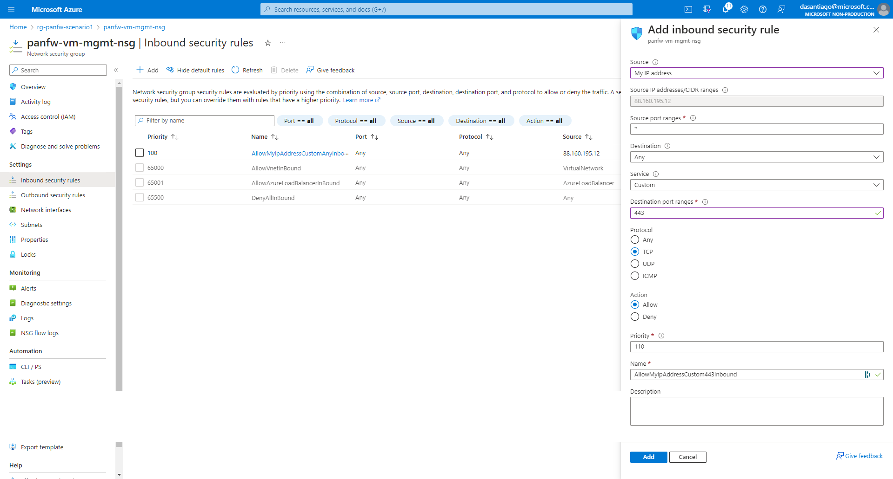
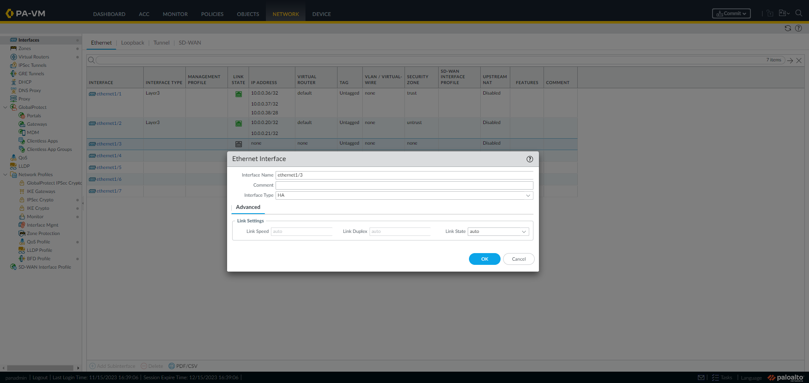

### [<< BACK TO THE MAIN MENU](../README.md)

# Scenario #2: HA FW (Active / Passive)

In this scenario, two instances of the VM-Series firewalls will be deployed on Azure: one functioning as the **Active** instance, and the other as the **Passive** instance.

## Overview

In this Active/Passive scenario, one instance constantly remains Active while the other remains Passive. The Active instance possesses both a floating trusted IP and a floating untrusted public IP. In the event of a failover between the instances, the floating IPs are reassigned to the newly Active instance.


High Availability (HA) interfaces are crucial for synchronizing data and monitoring the health of each instance. They enable seamless failover by ensuring data continuity and system availability in case of an Active instance failure.

Here is an illustration of a failover:


Throughout the tasks in this scenario, we will guide you through:
* Deploying the template
* Enabling your public IP for console access
* Connecting to the Palo Alto console
* Setting up Palo Alto instances for High Availability

## Task 1: Deploy Templates

To begin the Terraform deployment, follow these steps:

- Sign in to Azure Cloud shell at [https://shell.azure.com/](https://shell.azure.com/) or use your local terminal

- Confirm that you are operating within the appropriate subscription by using:

`az account show`

- Accept the Azure Marketplace terms for the VM-Series images:

`az vm image terms accept --publisher paloaltonetworks --offer vmseries-flex --plan byol --subscription MySubscription` 

- Clone the current GitHub repository with the command: 

`git clone https://github.com/davidsntg/microhack-azure-panfw`

- Navigate to the new folder *microhack-azure-panfw/* and initialize the terraform modules with the commands:

`cd microhack-azure-panfw/scenario2/templates`

`terraform init`

- Start the deployment by running:

`terraform apply`

- When prompted, confirm the start of the deployment by responding with a **yes**

- Wait for the deployment to finish, which should take approximately 10 minutes

## Task 2: Enable your Public IP to Access the Palo Alto Consoles

The Palo Alto administration console can be accessed via HTTPS, using the appliance's public management IP.

During deployment, the public IP from which Terraform is executed provides access to the administration console. 

If this IP differs from the client's public IP accessing the administration console, the NSG `panfw-vm-mgmt-nsg` must be updated:



## Task 3: Connect to the Palo Alto Consoles

- **Open a web browser with two tabs** and navigate to the Palo Alto Consoles. The URL, username and password are given by the results of the previous `terraform apply`:


Run the command `terraform output paloalto_password` to display the password in plain text.

> **Note**: The Firewall may take between 5-10 minutes to start up. If the console does not appear, feel free to refresh the page.

## Task 4: Configure HA interfaces 

> Below steps must be **executed on both Palo Alto Consoles** of the two appliances:

* Navigate to the *Network* tab in the administration console. Under *Interfaces*, select *ethernet1/3* interface
* Configure *ethernet1/3* as `HA` interface type:



* Click 'OK' and Commit changes
* Check *ethernet1/3* is configure and up:


## Task 5: Configure High Availability

To configure High Availability, it is required to configure HA1 and HA2 links:
* The HA1 link (Control Link), is primarily used for control information exchange and synchronization between HA peers (heartbeats, hello message and configuration synchronization data). It is a best practice to use management interface as HA1.
* The HA2 link (Data Link) is responsible for carrying session setup information and data forwarding between the active and passive firewalls in HA pair. This ensures that the passive appliance has the same session information as the active appliance.

> Below steps must be executed on `panfw-vm-01` Palo Alto Console.

* Navigate to the 'Device' tab in the administration console and select 'High Availability'.
* Setup HA pair:
  * Enable HA: checked
  * Group ID: 1
  * Peer HA1 IP Address: 10.0.0.5 (*management private IP address*)

 


* Click 'OK' and Commit changes
* Go to 'HA Communications' tab and configure Data links HA2:
  * Enable Session Synchronization: checked
  * Port: ethernet1/3
  * IPv4/IPv6 Address: 10.0.0.52
  * Netmask: 255.255.255.240


* Click 'OK' and Commit changes

> Below steps must be executed on `panfw-vm-02` Palo Alto Console.

* Navigate to the 'Device' tab in the administration console and select 'High Availability'
* Setup HA pair:
  * Enable HA: checked
  * Group ID: 1
  * Peer HA1 IP Address: 10.0.0.4 (*management private IP address*)
* Click 'OK' and Commit changes
* Go to 'HA Communications' tab and configure Data links HA2:
  * Enable Session Synchronization: checked
  * Port: ethernet1/3
  * IPv4/IPv6 Address: 10.0.0.53
  * Netmask: 255.255.255.240

* Click 'OK' and Commit changes

## Task 6: Display High Availability Status 

> Below steps must be **executed on both Palo Alto Consoles** of the two appliances:

* Navigate to the 'Dashboard' tab in the administration console. Add "Interfaces", "High Availability" and "HA Cluster" Widgets:


* Observe the HA status on both appliances:


It is noticeable that:
1) There is one appliance in an active state and another in a passive state.
2) The interfaces of the passive appliance are down, which is standard operation in an HA pair. In this setup, the active appliance handles all traffic, while the other appliance remains passive and takes over only if the active appliance fails. Therefore, the passive appliance interfaces remain down until a failover event occurs.


* Click on 'Sync to peer' link on the Active instance.

## Task 7: Check - Policies Synchronisation

> Below tasks must be execute on one of the two instances. The goal is to verify that after the commit, the created security rule will be replicated on the other instance.

* Navigate to the *Policies* tab in the administration console. Under *Policies*, select *Security*. You will find a list of all security rules

* Create a new security rule by clicking on 'Add'. Configure the rule as follows:
  
  * Name: DUMB-RULE
  * Description: Dumb Rule to check synchronisation
  * Source zone: `trust`
  * Destination zone: `untrust`
  * Application: `windows-azure-service-updates`
  * Action: Allow
  * Log at Session Start: `checked`
  * Log at Session End: `checked`

Click on 'OK' to save the rule

* To apply new created rule, commit your changes to update the firewall's configuration

* After the commit has been made, check on the second instance that the new rule properly appeared

## Task 8: Configure fallback IP address

> Below steps must be executed on Active instance only. In this case, it is `panfw-vm-01`.
* In the Azure Portal, navigate to the trusted NIC and add a new IP configuration with the following details:
  * Name: trustvip
  * Allocation: Static
  * Private IP Address: 10.0.0.38


* Navigate to the untrusted NIC and modify existing primary IP configuration to associate public IP address `panfw-vm-untrusted-pip`  which was created during terraform deployment:


## Task 9: Palo Alto: Configure HA Service principal

A Service Principal is required to automate the failover process.

> Service Principal is an identity created to use with applications, hosted services, and automated tools to access Azure resources securely. This access is restricted by the roles assigned to the service principal, giving you control over which resources can be accessed and at what level.

For automatic failover, the Service Principal is needed to update  network configurations like managing IP addresses during a failover event (moving the failover IP from previous Active appliance to Passive appliance). 

* Create a Service Principal:

```bash
$ az ad sp create-for-rbac --name "AZ_SP_PANFW" --skip-assignment"
```


* In the Azure Portal, grand the `Contributor` built-in role to the Service Principal on the `rg-panfw-scenario2` resource group:

```bash
$ az role assignment create --assignee <appId> --role Contributor --resource-group rg-panfw-scenario2
```

Note: It is possible to apply more granual permissions as explained in [the documentation](https://docs.paloaltonetworks.com/vm-series/9-1/vm-series-deployment/set-up-the-vm-series-firewall-on-azure/configure-activepassive-ha-for-vm-series-firewall-on-azure). Contributor built-role will be enough for this MicroHack.

> Below steps must be **executed on both Palo Alto Console** of the two appliances.

* Navigate to the 'Device' tab in the administration console and select 'VM-Series'
* Configure Azure HA Configuration:
  * Client ID: `appId` value 
  * Client Secret: `password` value
  * Tenant ID: `tenant` value
  * Subscription ID: Execute `$ az account show --query id --output tsv` to get the `subscriptionId`
  * Resource Group: `rg-panfw-scenario2`


## Task 10: Check - Active/Passive failover

* In the Azure Portal, navigate to the Active appliance a shutdown the virtual machine
* Check that the appliance which was Passive becomes Active:


After approximately 2 minutes, it can be observed that the appliance, which is now active, starts receiving traffic.

This is because the `trustedvip` has been shifted to the NIC of the appliance, which was previously passive and is now active. Similarly, the public IP `panfw-vm-untrusted-pip` is now associated with the untrusted NIC of the appliance, which transitioned from being passive to active.


## 🏁 Results

* We deployed two instances of the VM-Series firewall on Azure in an Active/Passive configuration. The Active instance utilized a floating trusted IP and a floating untrusted public IP.
* The HA interfaces were configured for data synchronization and health monitoring. High Availability was set up between the instances ensuring seamless failover during any instance failure.
* The security rule synchronization between the two instances was successfully verified. A fallback IP address was also configured.
* A Service Principal was created and assigned a 'Contributor' role. This automated the failover process and managed IP addresses during a failover event.
* The failover process was tested by manually shutting down the active appliance from the Azure Portal. The previously passive appliance transitioned to an active state.
* After approximately 2 minutes, the now active appliance started receiving traffic. This demonstrated the effectiveness of the Active/Passive configuration in maintaining high availability and ensuring seamless failover.

# Appendix

* [Azure Terraform VMSeries Fast HA Failover](https://github.com/PaloAltoNetworks/azure-terraform-vmseries-fast-ha-failover)

### [>> GO TO SCENARIO #3](../scenario3/README.md)
