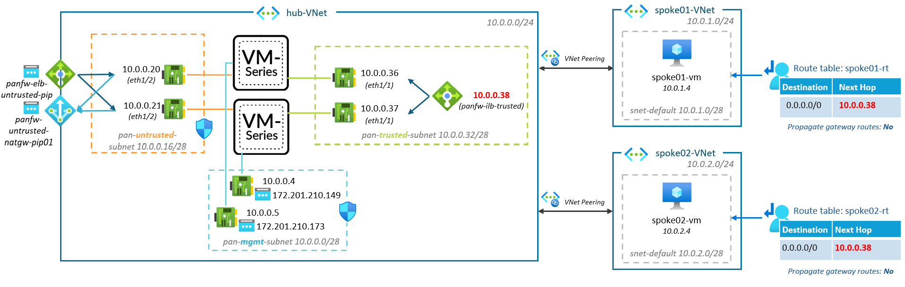

### [<< BACK TO THE MAIN MENU](../README.md)

# Scenario #3: Active-Active loadbalanced with ELB/ILB

In this scenario, two instances of the VM-Series firewalls will be deployed on Azure: both running as **Active** instances.

## Overview

In this Active/Active scenario, both instances actively handle traffic, distributing the load efficiently, ensuring continuous service availability even during maintenance or failures and offering a higher throughput compared to the Active/Passive scenario.



In this setup:
* The internal load balancer handles traffic within the Azure network
* The external load balancer manages incoming traffic from the internet or outgoing traffic to the internet
* Both firewalls process traffic
* The firewalls do not share state as in a traditional Active/Passive (or Active/Active with an HA4 interface), there is no mechanism in place for session syncing between the instances in this setup
* The VM-Series firewalls operate as an Active/Passive pair where only one firewall is passing traffic at a time

### VM-Series instances configuration

In this scenario, VM-Series firewalls are preconfigured.
* Interface `ethernet1/1`:
  * Management Profile: MP-Trust *(HTTPS)*
  * IP Address: DHCP
  * Virtual Router: VR-Trust
  * Security Zone: trust

* Interface `ethernet1/2`:
  * Management Profile: MP-Untrust *(SSH)*
  * IP Address: DHCP
  * Virtual Router: VR-Untrust
  * Security Zone: untrust

> To ensure proper routing and management of traffic, it is crucial to define two distinct Virtual Routers (Trusted and Untrusted) on Panorama, as the Azure Internal Load Balancer and External Load Balancer rely on the same probing source IP address 168.63.129.16.

Security Policies are set up to:
* Permit traffic using the ICMP (ping) protocol within the trust zone
* Allow HTTP and HTTPS protocol traffic from the `trust` zone to the `untrust` zone
* Allow probing by Azure Load Balancer on both trusted and untrusted interfaces
* Deny everything else

## Task 1: Deploy Templates

To begin the Terraform deployment, following these steps:

- Sign in to Azure Cloud shell at [https://shell.azure.com/](https://shell.azure.com/) or use your local terminal

- Confirm that you are operating within the appropriate subscription by using:

`az account show`

- Accept the Azure Marketplace terms for the VM-Series images:

`az vm image terms accept --publisher paloaltonetworks --offer vmseries-flex --plan byol --subscription MySubscription` 

- Clone the current GitHub repository with the command: 

`git clone https://github.com/davidsntg/microhack-azure-panfw`

- Navigate to the new folder *microhack-azure-panfw/* and initialize the terraform modules with the commands:

`cd microhack-azure-panfw/scenario3/templates`

`terraform init`

- Start the deployment by running:

`terraform apply`

- When prompted, confirm the start of the deployment by responding with a **yes**

- Wait for the deployment to finish, which should take approximately 10 minutes

## Task 2: Enable your Public IP to Access the Palo Alto Consoles

The Palo Alto administration console can be accessed via HTTPS, using the appliance's public management IP.

During deployment, the public IP from which Terraform is executed provides access to the administration console. 

If this IP differs from the client's public IP accessing the administration console, the NSG `panfw-vm-mgmt-nsg` must be updated:


## Task 3: Connect to the Palo Alto Consoles

- **Open a web browser with two tabs** and navigate to the Palo Alto Consoles. The URL, username and password are given by the results of the previous `terraform apply`:


Run the command `terraform output paloalto_password` to display the password in plain text.

> **Note**: The Firewall may take between 5-10 minutes to start up. If the console does not appear, feel free to refresh the page.


## Task 4: HA Check - Step-by-Step shutdown VM-Series instances

In this task, we will sequentially power down the VM-Series instances while generating traffic between the VM `spoke01-vm` and the VM `spoke02-vm`. 

This will allow us to confirm that there's no significant disruption in service. Here are the steps:

* Open the 'Serial Console' of the VM `spoke02-vm` from the Azure portal
* Login using the same login credentials as those used for the Palo Alto console
* Initiate a ping to the VM `spoke01-vm`: `ping 10.0.1.4`


* Shutdown the VM `panfw-vm-01`
* Check that the ping to VM `spoke01-vm` is still successful
* Start the VM `panfw-vm-01`, wait for 5 minutes, then stop the VM `panfw-vm-02`
* Again, verify that the ping to VM `spoke01-vm` is successful
* Finally, start the VM `panfw-vm-01`

* Observe the result of the previous operations in the metrics of the internal load balancer `panfw-trusted-ilb`:


## Task 5: DNAT Rule - Expose `spoke02-vm` on to the Internet 

In this task, we aim to make the `spoke02-vm` VM accessible from the internet. 

To do this, we will SSH the public IP `panfw-vm-elb-untrusted-pip`, which is attached to the external load balancer `panfw-untrusted-elb`, and set up a NAT rule to redirect the flow to spoke02-VM. A Security rule will then be created.

On Azure's side, a load balacing rule has already been created on the external load balancer during terraform deployment:


A new rule just needs to be created on the NSG `panfw-vm-untrusted-nsg` to permit traffic from the internet on port 22:


Let's now configure the VM-Series firewalls. 

> Execute the following steps on the `panfw-vm-01` instance:

* Navigate to the "NAT" tab under Policies and create a new rule:
  *  General
     *  Name: TEMP-NAT-SSH_Internet-Spoke02-VM


  * Original Packet
    * Source zone: untrust
    * Destination zone: untrust
    * Destination interface: ethernet1/2
    * Service: SSH
    * Destination Address: 10.0.0.20


  * Translated Packet
    *  Source Address Translation
       *  Type: Dynamic IP and Port
       *  Address Type: Interface Address
       *  Interface: ethernet1/1
    * Destination Address Translation:
      * Type: Static IP
      * Translated Address: 10.0.2.4 


* Go to the "Security" tab in Policies and create a new rule:
  * Name: A-TEMP-SSH-INTERNET-SPOKE02VM
  * Source Zone: untrust
  * Destination Zone: trust
  * Destination Address: 10.0.0.20/32
  * Service: SSH
  * Action: Allow

* Position this rule prior to the "deny all" rule:


* Click 'OK' and Commit changes

> Execute the following steps on the `panfw-vm-02` instance:

* Navigate to the "NAT" tab under Policies and create a new rule:
  *  General
     *  Name: TEMP-NAT-SSH_Internet-Spoke02-VM
  * Original Packet
    * Source zone: untrust
    * Destination zone: untrust
    * Destination interface: ethernet1/2
    * Service: SSH
    * Destination Address: 10.0.0.21
  * Translated Packet
    *  Source Address Translation
       *  Type: Dynamic IP and Port
       *  Address Type: Interface Address
       *  Interface: ethernet1/1
    * Destination Address Translation:
      * Type: Static IP
      * Translated Address: 10.0.2.4 

* Go to the "Security" tab in Policies and create a new rule:
  * Name: A-TEMP-SSH-INTERNET-SPOKE02VM
  * Source Zone: untrust
  * Destination Zone: trust
  * Destination Address: 10.0.0.21/32
  * Service: SSH
  * Action: Allow

* Position this rule prior to the "deny all" rule:

* Click 'OK' and Commit changes

Finally, test that is works by accessing the public IP `panfw-vm-elb-untrusted-pip` associated to the external load balancer `panfw-untrusted-elb` from an SSH client on your machine.


## Task 6: Internet breakout with NAT Gateway

Currently, the VMs `spoke01-vm` and `spoke02-VM` are able to connect to the internet using a configured NAT rule (`NAT-INTERNET-OUT`) using the public IP `panfw-vm-elb-untrusted-pip` associated to the external load balancer `panfw-untrusted-elb`.

It is possible to check that from `spoke02-vm`:
```bash
spoke02-vm:~$ curl ifconfig.me
20.101.96.114
```

This internet breakout design has some limitation: an issue of SNAT port exhaustion can arise; the recommendation is to use a NAT Gateway.

A NAT Gateway can mitigate [SNAT port exhaustion](https://azure.microsoft.com/en-us/blog/dive-deep-into-nat-gateway-s-snat-port-behavior/):
* by providing a dynamic pool of SNAT ports, reducing the risk of connection failures. 
* by randomly selecting and reusing SNAT ports, preventing ports from being selected too quickly for the same destination. 
* by allowing for multiple connections at the same time to different destination endpoints even when all SNAT ports are in use. 

----

* Go to Azure Portal, and search 'NAT Gateway' in the marketplace
  * Resource Group:  `rg-panfw-scenario3` 
  * NAT gateway name: panfw-untrusted-natgw
  * Region: West Europe


  * Outbound IP
    * Public IP addresses: (New) panfw-untrusted-natgw-pip01


  * Subnet: 
    * VNet: hub-vnet
    * Subnet: pan-untrusted-subnet


After a couple of minutes, check again outgoing public IP from `spoke02-vm`:
```bash
spoke02-vm:~$ curl ifconfig.me
40.91.212.148
```

`40.91.212.148` is indeed the public IP associated to the NAT Gateway:


## 🏁 Results

* Successfully deployed two instances of the VM-Series firewalls on Azure, both running as active instances.
* Confirmed continuous service with no significant disruption during sequential shutdown of the VM-Series firewalls.
* Successfully exposed the `spoke02-vm` VM to the internet by setting up a NAT rule and creating a security rule.
* Successfully created a NAT Gateway to mitigate the risk of SNAT port exhaustion. Confirmed the outgoing public IP from `spoke02-vm` is indeed associated with the NAT Gateway.

## Notes

In a production environment:
* VM-Series instances should be distributed across Availability Zones or inside an Availability Set 
* Panorama should be used to ease instances configuration

## Appendix:

* [YouTube - Active/Active NVA on Azure with HaPorts (Palo Alto and SAP RISE)](https://www.youtube.com/watch?v=uGFEJoZgq0U)

### [>> GO TO SCENARIO #4](../scenario4/README.md)
