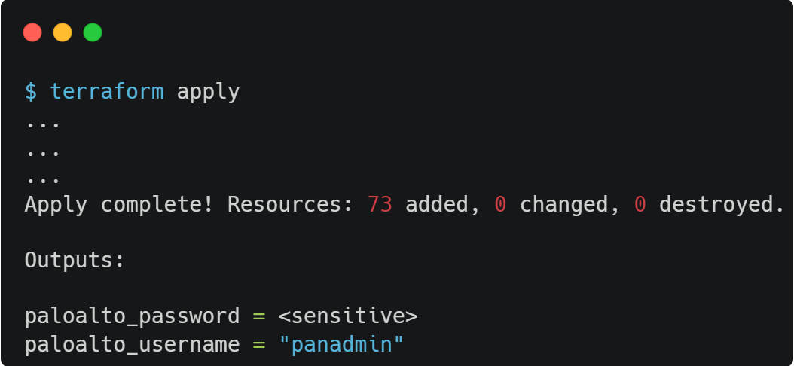

### [<< BACK TO THE MAIN MENU](../README.md)

# Scenario #4: Auto-Scaling with ELB/ILB

In this scenario, a group of VM-Series firewalls will be deployed on Azure using Azure's Virtual Machine Scale Set (VMSS) feature for auto-scaling. Unlike the previous scenario, these instances will not be fixed at two but will scale up or down depending on the load.

## Overview

In this Auto-scale scenario, a [Virtual machine scale set (VMSS)](https://learn.microsoft.com/en-us/azure/virtual-machine-scale-sets/overview) is used to deploy VM-Series firewalls. The number of active instances dynamically scales based on the load, ensuring efficient distribution of traffic and resource utilization.

In this setup:
* The internal load balancer handles traffic within the Azure network
* The external load balancer manages incoming traffic from the internet or outgoing traffic to the internet
* The number of firewalls processing traffic varies based on the load
* The firewalls do not share state as in a traditional Active/Passive (or Active/Active with an HA4 interface), there is no mechanism in place for session syncing between the instances in this setup
* The VM-Series firewalls within the VMSS operate dynamically, with the number of active firewalls adjusting based on configurable traffic load at any given time

### VM-Series instances configuration

In this scenario, VM-Series firewalls are preconfigured:
* Interface `ethernet1/1`:
  * Management Profile: MP-Trust *(HTTPS)*
  * IP Address: DHCP
  * Virtual Router: VR-Trust
  * Security Zone: trust

* Interface `ethernet1/2`:
  * Management Profile: MP-Untrust *(SSH)*
  * IP Address: DHCP
  * Virtual Router: VR-Untrust
  * Security Zone: untrust

> To ensure proper routing and management of traffic, it is crucial to define two distinct Virtual Routers (Trusted and Untrusted) on Panorama, as the Azure Internal Load Balancer and External Load Balancer rely on the same probing source IP address 168.63.129.16.

Security Policies are set up to:
* Permit traffic using the ICMP (ping) protocol within the trust zone
* Allow HTTP and HTTPS protocol traffic from the `trust` zone to the `untrust` zone
* Allow probing by Azure Load Balancer on both trusted and untrusted interfaces
* Permit traffic from the `trust` zone to the `trust` zone
* Deny everything else

### VMSS configuration

By default, the VMSS contains **only a single instance**. 

In this MicroHack, we will set up the scale-out and scale-in rules and test the system under increased load.

## Task 1: Deploy Templates

To begin the Terraform deployment, following these steps:

- Sign in to Azure Cloud shell at [https://shell.azure.com/](https://shell.azure.com/) or use your local terminal

- Confirm that you are operating within the appropriate subscription by using:

`az account show`

- Accept the Azure Marketplace terms for the VM-Series images:

`az vm image terms accept --publisher paloaltonetworks --offer vmseries-flex --plan byol --subscription MySubscription` 

- Clone the current GitHub repository with the command: 

`git clone https://github.com/davidsntg/microhack-azure-panfw`

- Navigate to the new folder *microhack-azure-panfw/* and initialize the terraform modules with the commands:

`cd microhack-azure-panfw/scenario4/templates`

`terraform init`

- Start the deployment by running:

`terraform apply`

- When prompted, confirm the start of the deployment by responding with a **yes**.

- Wait for the deployment to finish, which should take approximately 10 minutes.

## Task 2: Enable your Public IP to Access the Palo Alto Consoles

The Palo Alto administration console can be accessed via HTTPS, using the appliance's public management IP.

During deployment, the public IP from which Terraform is executed provides access to the administration console. 

If this IP differs from the client's public IP accessing the administration console, the NSG `panfw-vm-mgmt-nsg` must be updated:

## Task 3: Connect to the Palo Alto Consoles

- **Open a web browser with two tabs** and navigate to the Palo Alto Consoles. The URL, username and password are given by the results of the previous `terraform apply`:

Run the command `terraform output paloalto_password` to display the password in plain text.

> **Note**: The Firewall may take between 5-10 minutes to start up. If the console does not appear, feel free to refresh the page.

## Task 4: Configure VMSS autoscale based on metrics

* In `rg-panfw-scenario4` resource group, select `panfw-vmss` VMSS and navigate to the 'Scaling' tab
* Configure the Custom autoscale policy:
  * Scale based on a metric:
    * Scale out: When panfw-vmss (Average) Percentage CPU > 60 (10 minutes) => Increase count by 1
    * Scale in: When panfw-vmss (Average) Percentage CPU < 40 (during 10 minutes) => Decrease count by 1
    * Minimum instance: 1
    * Maximum: 10
    * Default: 1

* Save the Custom autoscale policy

## Task 5: Observe VMSS scale out

In this task, the CPU of the VMSS instance will be stressed to observe the scale-out process and the subsequent deployment of multiple instances. 

This will be achieved using the `iperf` tool, installed on five VMs in `spoke01-vnet` and another five VMs in `spoke02-vnet`:
* The VMs in spoke02-vnet will act as the `iperf` servers
  * `iperf` server is already running on these VMs
* The VMs in spoke01-vnet will act as the `iperf` clients

Here are the steps:
* Launch five separate tabs in the browser
* For each tab, access the 'Serial Console' on the respective VMs - `spoke01-vm01`, `spoke01-vm02`, `spoke01-vm03`, `spoke01-vm04` and `spoke01-vm05`
* Login using the same login credentials as those used for the Palo Alto console
* Begin the stress test:
  * From `spoke01-vm01`, execute `iperf -c 10.0.2.4 -t 3600 -P 10`
  * From `spoke01-vm02`, execute `iperf -c 10.0.2.5 -t 3600 -P 10`
  * From `spoke01-vm03`, execute `iperf -c 10.0.2.6 -t 3600 -P 10`
  * From `spoke01-vm04`, execute `iperf -c 10.0.2.7 -t 3600 -P 10`
  * From `spoke01-vm05`, execute `iperf -c 10.0.2.8 -t 3600 -P 10`

* Open an another tab and navigate to the `panfw-vmss` VMSS
* Display 'Monitoring' metrics and observe CPU increase:

* Wait ~10 minutes and observe the creation on new Instances in 'Instances' tab:

> We can observe that multiple instances are under creation. This is because [overprovisioning](https://learn.microsoft.com/en-us/azure/virtual-machine-scale-sets/virtual-machine-scale-sets-design-overview#overprovisioning) is enabled: the scale set actually spins up more VMs than you asked for, then deletes the extra VMs once the requested number of VMs are successfully provisioned.

* Display again the CPU (average) of the VMSS:

## Task 6: Observe VMSS scale in

* Terminate the stress test by pressing `CTRL+C` in each of the five Serial Consoles
* Wait ~10 minutes
* In 'Scaling' tab, go to 'Run history' tab:

This scale in was trigger by the scale-in policy configured && triggered before:

## 🏁 Results

* Successfully deployed using Azure's Virtual Machine Scale Set (VMSS) feature.
* Successfully configured scale-out and scale-in rules.
* Successfully triggered the scale-out and scale-in process.

## Notes

In a production environment:
* Panorama should be used to ease instances configuration.

### [>> GO TO SCENARIO #5](../scenario5/README.md)
